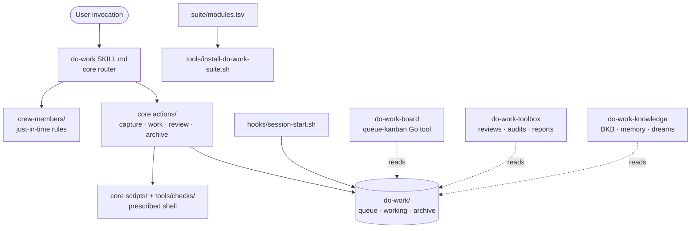
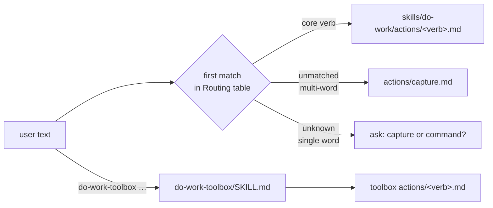
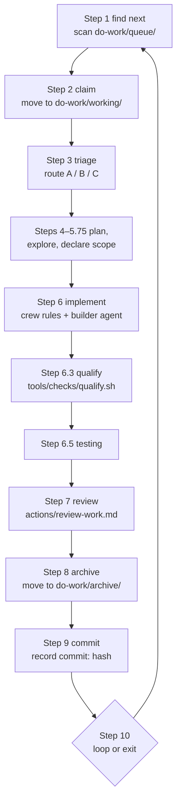
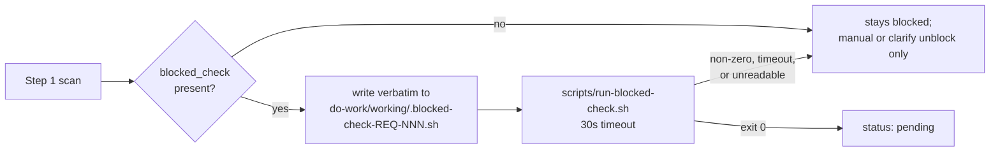
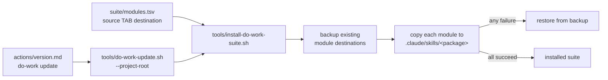

verified-at: 3c876ec · 2026-08-26 · 0.238.0 · prior: none

# Architecture Report — skill-do-work

Every claim below is labelled `VERIFIED` (anchored at `path:line` or quoted command output) or `INFERRED` (with its basis stated). Structural claims a reader might doubt carry a `Reproduce:` line.

## §Δ Changed since last report

first report — no prior baseline.

## §0 Orientation

Top two levels, one line each.

| Path | What lives there | Who reads it |
|---|---|---|
| `README.md` | Installation and quick usage | A user deciding whether to install the suite |
| `CLAUDE.md` | Maintainer instructions for this repository | An agent working on do-work itself; export-ignored, never shipped |
| `AGENTS.md` | Stub redirecting to `CLAUDE.md` | Agents whose harness looks for `AGENTS.md` |
| `VERSION` | The shared four-skill suite version | The install and update paths; mirrored in each package |
| `CHANGELOG.md` | Release notes, newest first | Users and the `version` action; mirrored into `skills/do-work/` |
| `CHANGELOG-*-up-to-*.md` | Rolled-off changelog history | Anyone tracing a release older than the live file |
| `suite/modules.tsv` | The only source→destination manifest for the four packages | The installer, the updater, and both reference checkers |
| `skills/do-work/` | Core: router, lifecycle actions, crew members, hooks, specs, scripts, updater | Every run of the suite |
| `skills/do-work-board/` | Board: the Go `queue-kanban` tool, the board action, the managed Just template | Anyone looking at the queue as a human |
| `skills/do-work-knowledge/` | Knowledge: BKB, memory, dreams, interviews, prompts | Retained-knowledge flows |
| `skills/do-work-toolbox/` | Toolbox: reviews, audits, reports, presentation, repository utilities | Optional work outside the request lifecycle |
| `tools/` | Root bootstrap only — installer, manifest validator, managed-section and upstream-archive helpers | A fresh install, before any package exists |
| `decisions/` | ADRs under `records/`, imported specs, topic indexes, the decision log | Anyone asking why the architecture is shaped this way |
| `_dev/` | Maintainer-side tests, primes, and lessons | This repository only; export-ignored |
| `do-work/` | This repository's own queue state — archive, runs, audits, checkpoints | The suite, running against itself |
| `kb/` | Compiled knowledge-base wiki, agents, and raw sources | Knowledge flows |
| `ai-reports/` | Dated report bundles from `ai-report` and `architecture-report` | Humans reading past deliverables, and future runs of `architecture-report` |
| `justfile` | Managed recipe entry point | Maintainers running board and check recipes |

`VERIFIED` — `find . -maxdepth 2` against the tree at `3c876ec`; package roles at `skills/do-work/SKILL.md:9-14`; the manifest's exclusivity at `CLAUDE.md:64`.

`INFERRED` — the "who reads it" column, from each directory's own header prose and its citations, not from an access trace.

## §1 Architecture overview



**CoreRouter** — `skills/do-work/SKILL.md`. A first-match-wins trigger table that maps user input to exactly one action file, then reads that file completely and passes arguments through. It is the only always-loaded file in core, which is why it is budgeted rather than grown. `VERIFIED` at `skills/do-work/SKILL.md:22-44`.

**CoreActions** — `skills/do-work/actions/`. One file per verb. `capture.md` turns intent into a UR plus linked REQs; `work.md` runs the ten-step pipeline over the queue; `review-work.md` grades the result; `cleanup.md` closes URs. Companion `*-reference.md` files hold the mechanics the action file points at rather than repeats. `VERIFIED` — the routing table's targets all resolve at `skills/do-work/SKILL.md:26-40`.

**Crew** — `skills/do-work/crew-members/`. Rules files loaded just-in-time during a build. `general.md`, `coding-guardrails.md`, and `communication-style.md` always load during implementation; the rest are conditional on a REQ field or an ingestion condition. Each file's `JIT_CONTEXT` comment is the canonical statement of when it loads. `VERIFIED` at `skills/do-work/actions/work.md:367-375`.

**Queue** — `do-work/` in the consuming project. `queue/` holds pending REQs, `working/` holds the claimed one, `archive/` holds finished work as UR folders plus legacy REQs, `user-requests/` holds active UR folders. It is plain markdown with YAML frontmatter, not a database. `VERIFIED` at `skills/do-work/actions/work.md:83`.

**Scripts** — `skills/do-work/scripts/` and `skills/do-work/tools/checks/`. Shell promoted out of action prose whenever the prose described an exact command sequence. Each has fixture proofs under `_dev/tests/prescribed-shell-cases/`. `VERIFIED` — 11 scripts and 8 checks at `3c876ec`; `Reproduce: ls skills/do-work/scripts skills/do-work/tools/checks`.

**Hooks** — `skills/do-work/hooks/`. One `SessionStart` hook, which repairs REQ timestamps and reaps stale REQ-number reservations. `VERIFIED` at `skills/do-work/hooks/hooks.json:3-12`.

**Board / Toolbox / Knowledge** — the three sibling packages. They are installed beside core and reach it through explicit relative paths; they read core's artifacts and never own the request lifecycle. `VERIFIED` at `skills/do-work-toolbox/SKILL.md:35-38` (ownership boundary) and `skills/do-work-board/SKILL.md:11`.

**Manifest / Installer** — `suite/modules.tsv` is the sole declaration of what installs where; `tools/install-do-work-suite.sh` reads it tab-separated and copies each module to its destination with rollback. `VERIFIED` at `suite/modules.tsv:1-5` and `skills/do-work/tools/install-do-work-suite.sh:196`.

## §2 Execution flows

### Flow 1 — Command dispatch



Every edge crossing a file boundary names the file it crosses on. The core router dispatches by reading `./actions/<verb>.md` completely and passing `$ARGUMENTS` through; a sibling package is addressed by name (`do-work-toolbox <verb>`) and does its own first-match routing. An unmatched multi-word input is treated as a capture; an unknown single word is ambiguous and asks. `VERIFIED` at `skills/do-work/SKILL.md:24-44` and `skills/do-work-toolbox/SKILL.md:13-34`.

`Reproduce: sed -n '22,46p' skills/do-work/SKILL.md`

### Flow 2 — The work pipeline



The crossing artifacts, edge by edge: Step 1 reads `status` frontmatter from `do-work/queue/REQ-*.md` in number order without reading bodies; Step 2 moves the file into `do-work/working/`; Step 3 writes `route: A | B | C`; Step 6 spawns a builder with the loaded crew files and the REQ's declared `write_set` as its write boundary; Step 6.3 runs `tools/checks/qualify.sh`, which exits 1 on a real failure and 2 on a usage error; Step 8 moves the REQ into `do-work/archive/` and stamps `completed_at`; Step 9 records the implementation hash into `commit:`. `VERIFIED` at `skills/do-work/actions/work.md:122,208,220,225,365,430,469,490,555,627,639` and the exit codes at `skills/do-work/tools/checks/qualify.sh:32,62,67`.

`Reproduce: grep -n '^### Step ' skills/do-work/actions/work.md`

### Flow 3 — Blocked-condition re-probe



`blocked_check` is user-authored shell run verbatim, so the boundary matters: it is staged to a scratch file under `do-work/working/`, handed to the shipped timeout runner, and removed. Exit 0 is the only unblock; every other outcome — including a timeout or an unreadable probe — leaves the REQ blocked. In targeted mode the probe set is only the named REQs plus those reached by UR expansion, so a scoped run never fires a stranger's probes. `VERIFIED` at `skills/do-work/actions/work.md:130-133` and `skills/do-work/actions/work-reference.md:182`.

### Flow 4 — Install and update



The manifest is read tab-separated, one module per line after the header. Each destination is backed up before it is replaced and restored if any module fails, so a partial install is not a state the suite can land in. The update path is required to go through `tools/do-work-update.sh --project-root <project-root>` rather than reproducing the steps. `VERIFIED` at `skills/do-work/tools/install-do-work-suite.sh:103-111,196` and `skills/do-work/actions/version.md:46,94`.

## §3 Contracts and boundaries

### REQ status enum and legal transitions

| Status | Meaning | Leaves via | Anchor |
|---|---|---|---|
| `pending` | Queued, selectable by the default scan | claim → `claimed` | `work-reference.md:246` |
| `claimed` | Held by a run; lives in `do-work/working/` | terminal flip at Step 8 | `work.md:220` |
| `pending-answers` | Waiting on user answers; scan walks past | `clarify` answer → `pending` | `work-reference.md:246` |
| `blocked` | Waiting on an external condition; scan walks past | passing `blocked_check`, clarify, or hand edit → `pending` | `work-reference.md:179` |
| `completed` | Terminal, successful | — | `work-reference.md:264` |
| `completed-with-issues` | Terminal, successful, carries known follow-ups | — | `work-reference.md:264` |
| `failed` | Terminal, not successful; holds its UR open | — | `work-reference.md:264` |
| `cancelled` | Terminal, deliberate won't-do via `abandon` | — | `work-reference.md:270` |
| `blocked-archive-collision` | Terminal-blocking; archive path already taken | — | `work-reference.md:246` |
| `blocked-dependency-cycle` | Terminal-blocking; `depends_on` cycle | — | `work-reference.md:246` |

`VERIFIED` — every row above is anchored in `skills/do-work/actions/work-reference.md` at the line given.

Two derived sets are the canonical filters: **terminal-success** is `completed` + `completed-with-issues` (`work-reference.md:264`), and **terminal-resolved** adds `cancelled` (`work-reference.md:270`). Both state the *condition* as the contract and mark their consumer lists illustrative.

### Schema read contract

| Rule | Behaviour | Anchor |
|---|---|---|
| Normalize first | Apply the per-field alias map; a canonical match is used silently | `work-reference.md:233` |
| Warn on fallback | Unrecognized value emits `⚠ {field}: '{value}' not recognized …` and proceeds with the documented default | `work-reference.md:234-240` |
| Never silently drop | The warning is the feedback channel whose absence let `dependencies:` go unnoticed before 0.76.2 | `work-reference.md:241` |
| `status` default | Skip the REQ with the warning — never claim or archive an unrecognized status | `work-reference.md:246` |
| `impact` default | `impact-user-visible`, deliberately never `impact-negligible` | `work-reference.md:253` |
| `effort_estimate` default | `effort-substantive`; `trivial`/`normal` are read-only legacy aliases | `work-reference.md:254` |
| Verbatim-read class | `assigned_to`, `write_set`, `sweep_key`, `stakeholder`, `blocked_by`, `blocked_check` — no alias map, no case folding, trim only | `work-reference.md:147,151,183` |

`VERIFIED` — every row above is anchored at the line given in `skills/do-work/actions/work-reference.md`.

### Exit-code meanings

| Code | Meaning | Anchor |
|---|---|---|
| `0` | The check passed, or the probe's condition holds | `tools/checks/preflight.sh:147` |
| `1` | A real failure the caller must act on, including an unresolvable commit range | `tools/checks/qualify.sh:13,62` |
| `2` | Usage error — wrong arguments, not a finding | `tools/checks/qualify.sh:32` |
| `126`/`127` | The probe never launched; preflight records `"launched": false` and writes no failures file | `tools/checks/preflight.sh:23` |

`VERIFIED` — every row above is anchored at the line given.

A tool that prints findings on stdout while exiting zero is the documented counter-case: for those the verdict is the emptiness of the output, never the status. `VERIFIED` at `_dev/primes/prime-shell-commands.md` § Prescribed Shell Commands Must Surface What the Steps Consume; the live instance is gofmt in `_dev/tests/maintainer-verify.sh`.

### File formats

| Artifact | Format | Anchor |
|---|---|---|
| UR | Directory `do-work/user-requests/UR-NNN/` with `input.md` preserving the request verbatim | `skills/do-work/SKILL.md:20` |
| REQ | Single markdown file, YAML frontmatter plus appended P-A-U, Implementation, Review, and Lessons sections | `work-reference.md:147-198` |
| Suite manifest | TSV, header row then `source<TAB>destination` | `suite/modules.tsv:1` |
| Hook fragment | JSON under `hooks/`, merged into the consumer's settings | `skills/do-work/hooks/hooks.json` |
| Report bundle | `ai-reports/<slug>/index.html` with relative local assets | `skills/do-work-toolbox/actions/ai-report.md:125` |
| Architecture report | This file — dated markdown in an `ai-reports/` bundle, beside the HTML ones | `skills/do-work-toolbox/actions/architecture-report.md:134` |

`VERIFIED` — every row above is anchored at the file or line given.

### Naming conventions that carry load

| Convention | Rule | Anchor |
|---|---|---|
| Cross-package citation | Literal relative path from the citing file's own directory, at the depth the path spells — never `../<package>/` as shorthand | `_dev/primes/prime-action-files.md` § Cross-Referencing |
| Consumer-root path | `<project-root>/…` when the path names the consuming project rather than the package | `skills/do-work/actions/cleanup.md:248` |
| Names with reach | Two words minimum, findable by plain-text search | `skills/do-work/crew-members/coding-guardrails.md` § 5 Naming for Reach |
| `impact-` prefix | Every `impact:` value carries it, so one grep returns every REQ's verdict | `work-reference.md:152` |
| Action descriptions | Triggers, not summaries — the words that tell the router when to load the file | `_dev/primes/prime-action-files.md` § Descriptions Are Triggers |

`VERIFIED` — every row above is anchored at the file or section given.

## §4 Design decisions, conventions, and invariants

Sourced from `decisions/records/` (21 ADRs at `99d8b84`), `CLAUDE.md`, and the Lessons sections in `_dev/primes/`.

| Invariant | Consequence of breaking it | Source |
|---|---|---|
| Action files must work with any agentic tool that can read/write files and run shell | A tool-specific API in an action file makes the suite unusable on the floor it was designed for | `CLAUDE.md:110-116` |
| The router is budgeted, not grown | An always-loaded file costs every invocation; the fix is to merge or lazy-load, never to raise the budget | `_dev/tests/contract-regressions.sh:3514` |
| `suite/modules.tsv` is the sole source/destination declaration | A second declaration means the installer and the checkers can disagree about what ships | `CLAUDE.md:64` |
| The Kanban board has exactly three write surfaces, none touching pipeline state | A fourth surface makes the board a writer of queue state, which nothing downstream expects | `CLAUDE.md:74-76` |
| `CHANGELOG.md` is an owner-only, human-authored write | Tooling that writes it turns release notes into generated prose nobody reads | `CLAUDE.md:76` |
| Prose describing an exact command sequence becomes a script | Copy-pasted prescribed shell means one bug is fixed in one of four places | `CLAUDE.md:12` |
| Rules key on a condition; example lists are marked illustrative | A hand-enumerated list goes stale the moment the set grows, silently | `_dev/primes/prime-shell-commands.md` § Closed Enumerations Go Stale |
| The version bump, changelog entry, and mirrored changelog land in the integrating commit | A builder bumping them on its own branch races every sibling builder | `CLAUDE.md:78-100` |
| `bash _dev/tests/maintainer-verify.sh` exiting zero is the only proof | A summary or a builder's report is a claim; the exit status is the evidence | `CLAUDE.md:102-104` |
| A REQ's `write_set` is the collision guard, display-only on the board | Treating it as a safety guarantee lets two parallel builders write the same file | `CLAUDE.md` § Glossary |
| The legacy root runtime names stay retired — `docs`, `actions`, `hooks`, `specs` and their siblings hold no files at the repository root | A root `docs/` reads as the pre-cutover layout returning, so the check fails the tree; it is why this report lives under `ai-reports/` | `_dev/tests/staged-skills-contract.sh:60-74` |

`VERIFIED` — every row above is anchored at the file, line, or section given.

### Contractual absences

Capabilities deliberately removed or refused. A fresh reader who reintroduces one is undoing a decision, not filling a gap.

| Absent by design | Why | Source |
|---|---|---|
| No stateful, resumable pipeline | ADR-005 recorded it; it was removed as machinery that cost more than it bought | `decisions/records/adr-005-pipeline-is-stateful-and-resumable.md`; removal at `do-work/archive/UR-031/REQ-145-remove-stateful-pipeline.md` |
| No `--with-video` flag or automatic video from `ai-report` | Video is an explicit, separate action; automatic generation was retired | `skills/do-work-toolbox/actions/ai-report.md:109` |
| No `client brief` or separate `.single.html` explainer | Retired presentation artifacts; the contract suite rejects their vocabulary | `_dev/tests/contract-regressions.sh:1274` |
| No P80 or other percentile fields on `estimate:` | Deliberate — the forecast is one number with a confidence band | `work-reference.md:164` |
| No growth of `effort_estimate` toward t-shirt sizes | It is a two-value triage bit; the estimation system is the separate `estimate:` block | `work-reference.md:153` |
| No help flag that parses a script's own header | It couples help output to the header's literal shape; print a literal string or offer no help | `_dev/primes/prime-shell-commands.md` § Every Flag on a Shipped Script Needs a Non-Test Caller |
| No shipped file may cite `CLAUDE.md` or `AGENTS.md` | Both are export-ignored, so the citation dangles in every consumer install | `_dev/primes/prime-action-files.md` § Cross-Referencing |

`VERIFIED` — every row above is anchored at the file, line, or section given.

## §5 Freshness ledger

**Counts.** 21 `VERIFIED` claim blocks, 2 `INFERRED`. Derived, not remembered — `Reproduce: awk '/^## §5 /{f=1} !f' <this file> | grep -c '\bVERIFIED\b'` returns 22, one more than the count above because the header sentence naming the scheme is not itself a claim. A `VERIFIED` block covering a table asserts that every row in it is anchored at the line given. Every `VERIFIED` claim carries a `path:line` anchor or a quoted `Reproduce:` command; both `INFERRED` claims state their basis inline (§0's "who reads it" column, and §1's characterisation of the sibling packages as read-only consumers of core artifacts, which is drawn from the stated ownership boundary rather than from a write trace).

**Record–code disagreements.** None found at this commit. Both `decisions/_master_index.md` and `CLAUDE.md` were checked against the tree; the master index explicitly refuses to carry a record count and tells the reader to read `records/` instead, which is why the count in §4 is derived rather than quoted.

**Open questions deferred.**

- Q1 — `decisions/records/` contains ADR-005 describing a stateful, resumable pipeline that was later removed. The ADR is retained as history rather than marked superseded in the file itself. Whether the record set should carry an explicit superseded marker is a maintainer decision this report does not make.
- Q2 — `do-work/` at the repository root holds four hand-written coordination documents (`CHECKPOINT.md`, `HANDDOWN-UR-031.md`, `HANDOFF-2026-08-18-queue-241-245.md`, `RESTART-PROMPT.md`) alongside the machine-managed `archive/` and `runs/`. Whether those are live state or residue was not determinable from the files themselves.

**Out of scope.** Bugs, tech debt, security findings, and missing tests are not in this report by design. `do-work-toolbox maintainability-audit` owns measured code health under calibrated bands, and `do-work-toolbox quick-wins` owns grounded refactor and test opportunities.

**Watermark convention.** Every claim above was checked against the committed tree at `3c876ec`, and this report is committed as a child of it. The report therefore does not appear in the tree it describes, which is why §0 names `ai-reports/` without asserting its own presence there.

**Scoping the next run.** A future run computes its drift candidates against this report's watermark with:

```bash
git diff --stat 3c876ec..HEAD
```
